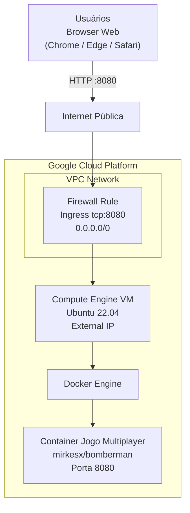

# Lab 001 - Jogo Web Multiplayer no Compute Engine (GCP)

## Objetivo

Provisionar uma VM no Google Compute Engine, instalar Docker, executar um jogo multiplayer em container e acessar o jogo via navegador na porta `8080`.

## Informações do lab

- Dificuldade: Iniciante
- Tempo estimado: 30 minutos

## Contexto de execução (Google Skills)

Você pode iniciar um ambiente de laboratório no Google Skills e usar os créditos mensais para executar este exercício.

Exemplos de labs para iniciar ambiente:

- https://www.skills.google/focuses/3563
- https://www.skills.google/focuses/11952

> Observação: os links acima servem para abrir um ambiente de prática no GCP. Depois de entrar no console, siga os passos deste roteiro e não os passos que o GCP Skills pede.

## Pré-requisitos

- Conta com acesso ao Google Cloud (preferencialmente via Google Skills)
- Projeto GCP ativo
- Permissão para criar VM e regra de firewall
- Cloud Shell ou terminal SSH da VM

## Arquitetura do lab

- 1 VM Ubuntu 22.04 no Compute Engine
- 1 regra de firewall liberando `tcp:8080`
- 1 container Docker com o jogo `mirkesx/bomberman`



## Passo 1 - Criar a VM

No Console do GCP:

1. Acesse `Compute Engine` → `VM instances` → `Create instance`
2. Configure:
   - Nome: `web-game-server`
   - Região/Zona: qualquer (ex.: `us-central1-a`)
   - Tipo: `e2-small` (2 vCPU, 2 GB RAM)
   - OS: `Ubuntu 22.04 LTS`
   - Disco: `10 GB` (Standard)
3. Crie a instância

> Não é obrigatório marcar `Allow HTTP` ou `Allow HTTPS` para este lab.

## Passo 2 - Criar regra de firewall (porta do jogo)

No Console do GCP:

1. Acesse `VPC network` → `Firewall` → `Create firewall rule`
2. Configure:
   - Name: `allow-web-game-8080`
   - Direction of traffic: `Ingress`
   - Targets: `All instances in the network`
   - Source IPv4 ranges: `0.0.0.0/0`
   - Protocols and ports: `Specified protocols and ports` → `tcp:8080`
3. Salve a regra

> Nota de segurança: neste lab didático, a origem `0.0.0.0/0` é usada para simplificar o acesso. Em cenários reais, restrinja os IPs de origem ao mínimo necessário.

## Passo 3 - Instalar Docker na VM

Conecte por SSH na VM e rode:

```bash
sudo apt update
sudo apt install -y docker.io
sudo systemctl enable --now docker
sudo usermod -aG docker $USER
newgrp docker
```

## Passo 4 - Executar o jogo em container

Na VM, rode:

```bash
docker pull mirkesx/bomberman
docker run -d --name jogo-web -p 8080:8080 mirkesx/bomberman
docker ps
```

## Passo 5 - Acessar no navegador

1. Copie o `External IP` da VM no Compute Engine
2. Abra no navegador:

```text
http://SEU_EXTERNAL_IP:8080/
```

Exemplo:

```text
http://34.28.78.68:8080/
```

## Validação guiada

### Teste 1 - Container em execução

Comando:

```bash
docker ps
```

Resultado esperado:

- Container `jogo-web` listado com status `Up`
- Mapeamento de porta exibindo `0.0.0.0:8080->8080/tcp`

### Teste 2 - Aplicação respondendo internamente

Comando:

```bash
curl http://localhost:8080
```

Resultado esperado:

- Retorno HTML/conteúdo da aplicação sem erro de conexão

### Teste 3 - Regra de firewall aplicada

Verificação no Console do GCP:

- Regra `allow-web-game-8080` criada
- Direção `Ingress`
- Porta `tcp:8080` liberada

### Teste 4 - Acesso externo funcionando

No navegador, acesse `http://SEU_EXTERNAL_IP:8080/`.

Resultado esperado:

- Jogo carregando no navegador a partir do IP externo da VM

---

Fonte base do roteiro: documento interno do curso (Lab_GCP_Jogo_Web_Multiplayer_Docker_Toolbox_PTBR_v2).
