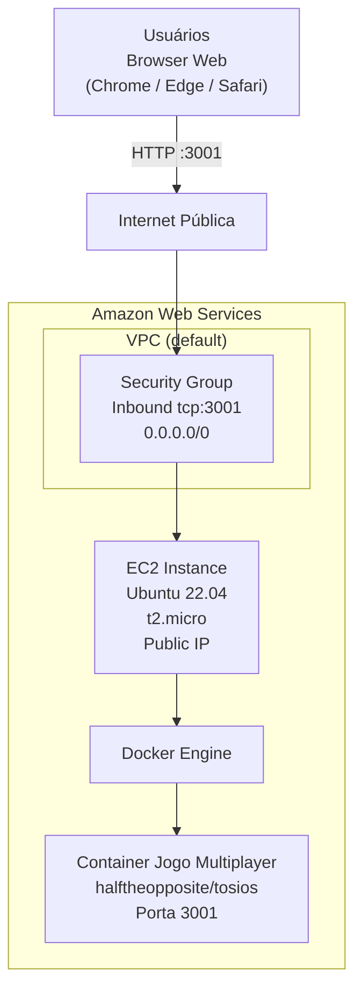

# Lab 001 - Jogo Web Multiplayer na AWS (EC2 ou ECS)

## Objetivo

Subir um jogo multiplayer web (`TOSIOS`) na AWS com duas opções de deploy:

- Opção A: EC2 Free Tier + Docker
- Opção B: ECS com Fargate (container service)

## Informações do lab

- Dificuldade: Iniciante
- Tempo estimado: 40-50 minutos

## Contexto de execução (AWS Free Tier)

Este lab tem duas trilhas com perfis de custo diferentes:

- **Opção A (EC2)**: elegível ao AWS Free Tier (12 meses)
   - EC2 `t2.micro`: 750 horas/mês
   - EBS: 30 GB/mês
- **Opção B (ECS/Fargate)**: pode consumir créditos/cobrança conforme uso

> **Atenção:** para aula com foco em Free Tier, priorize a **Opção A (EC2)**.

Para monitorar o consumo do Free Tier:  
`Billing and Cost Management` → `Free Tier` no console da AWS.

## Pré-requisitos

- Conta AWS ativa (Free Tier ou créditos disponíveis) 
- Acesso ao Console da AWS
- Região com EC2 `t2.micro` disponível (ex.: `us-east-1`, `sa-east-1`)

## Jogo usado no lab

- Imagem: `halftheopposite/tosios`
- Tipo: shooter 2D multiplayer no navegador
- Porta da aplicação: `3001`

## Arquitetura - Opção A (EC2)

- 1 instância EC2 Ubuntu 22.04 (`t2.micro`)
- 1 Security Group liberando `tcp:3001` (inbound) e `tcp:22` (EC2 Instance Connect)
- 1 container Docker com o jogo `halftheopposite/tosios`



## Opção A - Deploy no EC2 (Free Tier)

### Passo 1 - Criar o Security Group

No Console da AWS:

1. Acesse `EC2` → `Security Groups` → `Create security group`
2. Configure:
   - Name: `web-game-sg`
   - Description: `Security group para jogo web multiplayer`
   - VPC: default
3. Em **Inbound rules**, adicione duas regras:
   | Type | Protocol | Port | Source |
   |---|---|---|---|
   | Custom TCP | TCP | 3001 | 0.0.0.0/0 |
   | SSH | TCP | 22 | 0.0.0.0/0 |
4. Clique em `Create security group`

> Nota de segurança: source `0.0.0.0/0` é usado aqui apenas para simplificar o acesso didático. Em produção, restrinja os IPs de origem.

### Passo 2 - Criar a instância EC2

No Console da AWS:

1. Acesse `EC2` → `Instances` → `Launch instances`
2. Configure:
   - Name: `web-game-server`
   - AMI: `Ubuntu Server 22.04 LTS` (64-bit x86)
   - Instance type: `t2.micro` (**Free tier eligible**)
   - Key pair: `Proceed without a key pair` (usaremos EC2 Instance Connect)
   - Network settings: selecione o security group `web-game-sg`
   - Storage: 8 GB gp3 (padrão)
3. Clique em `Launch instance`

> Aguarde o status mudar para `Running` antes de prosseguir (~30 segundos).

### Passo 3 - Conectar na instância (EC2 Instance Connect)

1. Na lista de instâncias, selecione `web-game-server`
2. Clique em `Connect`
3. Selecione a aba `EC2 Instance Connect`
4. Clique em `Connect`

Um terminal no navegador será aberto diretamente na instância.

### Passo 4 - Instalar Docker na instância

No terminal da instância, rode:

```bash
sudo apt update
sudo apt install -y docker.io
sudo systemctl enable --now docker
sudo usermod -aG docker $USER
newgrp docker
```

### Passo 5 - Executar o jogo em container

```bash
docker pull halftheopposite/tosios
docker run -d --name jogo-web -p 3001:3001 halftheopposite/tosios
docker ps
```

### Passo 6 - Acessar no navegador

1. No console da AWS, copie o **Public IPv4 address** da instância
2. Abra no navegador:

```text
http://SEU_PUBLIC_IP:3001/
```

Exemplo:

```text
http://54.175.23.91:3001/

### Validação rápida (Opção A)

Comandos:

```bash
docker ps
curl -I http://localhost:3001
```

Esperado:

- Container `jogo-web` com status `Up`
- Porta `0.0.0.0:3001->3001/tcp`
- HTTP `200 OK`

---

## Opção B - Deploy no ECS (Fargate / container service)

> Esta opção prioriza o uso de serviço de containers gerenciado. Para turmas iniciantes, use em formato guiado (mais passos que EC2).

### Passo 1 - Criar ECS Cluster

1. Acesse `ECS` → `Clusters` → `Create cluster`
2. Nome: `web-game-cluster`
3. Infra: `AWS Fargate (serverless)`
4. Crie o cluster

### Passo 2 - Criar Task Definition

1. Acesse `ECS` → `Task definitions` → `Create new task definition`
2. Launch type: `Fargate`
3. Task name: `web-game-task`
4. CPU/Memória (mínimo para demo): `0.25 vCPU` e `0.5 GB`
5. Container:
   - Name: `web-game`
   - Image URI: `halftheopposite/tosios:latest`
   - Port mapping: `3001` (TCP)
6. Salve a task definition

### Passo 3 - Criar Security Group para o serviço

1. Em `EC2` → `Security Groups` → `Create security group`
2. Name: `web-game-ecs-sg`
3. Inbound rule:
   - Type: Custom TCP
   - Port: `3001`
   - Source: `0.0.0.0/0`

### Passo 4 - Criar Service no ECS

1. Dentro de `web-game-cluster`, clique `Create`
2. Compute options: `Launch type` → `Fargate`
3. Task definition: `web-game-task`
4. Service name: `web-game-service`
5. Desired tasks: `1`
6. Networking:
   - VPC: default
   - Subnets: públicas
   - Auto-assign public IP: `Enabled`
   - Security group: `web-game-ecs-sg`
7. Crie o service e aguarde task `Running`

### Passo 5 - Acessar no navegador

1. Abra `ECS` → `Clusters` → `web-game-cluster` → `Tasks`
2. Clique na task em execução
3. Copie o `Public IP`
4. Abra:

```text
http://SEU_PUBLIC_IP:3001/
```

### Validação rápida (Opção B)

- Task em estado `Running`
- Security group com `tcp:3001`
- Acesso HTTP externo funcionando na porta `3001`
```

## Limpeza

Para não gerar custo desnecessário após o lab:

1. **Terminar a instância:**  
   `EC2` → `Instances` → selecione `web-game-server` → `Instance state` → `Terminate instance`

2. **Deletar o Security Group do EC2 (opcional):**  
   `EC2` → `Security Groups` → selecione `web-game-sg` → `Actions` → `Delete security groups`

3. **Escalar/remover serviço ECS (Opção B):**
   - `ECS` → `Clusters` → `web-game-cluster` → `Services` → `web-game-service` → ajustar `Desired tasks` para `0` ou deletar service

4. **Remover task definition e Security Group do ECS (opcional):**
   - Apague `web-game-ecs-sg` se não estiver em uso

> Instâncias terminadas são removidas automaticamente após algumas horas. O disco EBS associado também é deletado por padrão.

## Referência

- [AWS Free Tier](https://aws.amazon.com/free/)
- [Imagem do jogo: halftheopposite/tosios](https://hub.docker.com/r/halftheopposite/tosios)
