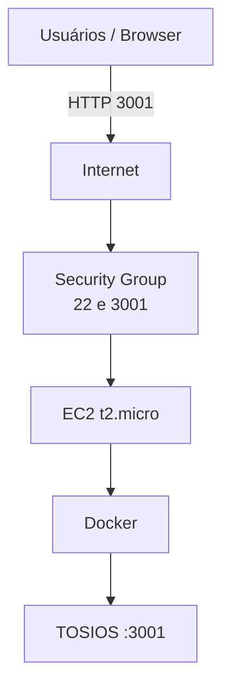
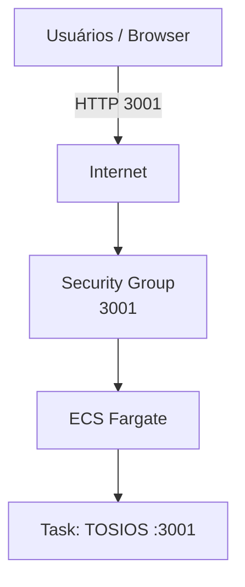

# Lab 001 - Jogo Web Multiplayer na AWS (EC2 ou ECS)

## Objetivo

Publicar o jogo `TOSIOS` na AWS com duas opções:

- **Opção A (recomendada):** EC2 + Docker (Free Tier)
- **Opção B:** ECS/Fargate (container service)

## Informações do lab

- Dificuldade: Iniciante
- Tempo estimado: 35-45 min
- Porta da aplicação: `3001`

## Pré-requisitos

- Se ainda não tiver conta, criar em: https://aws.amazon.com/free/
- Conta AWS ativa (Free Tier ou créditos)
- Acesso ao Console AWS - https://us-east-2.console.aws.amazon.com/
- Região com `t2.micro` disponível (`us-east-1` ou `sa-east-1`)

## Jogo usado

- Imagem Docker: `halftheopposite/tosios`
- Tipo: shooter 2D multiplayer em navegador

---

## Opção A - EC2 (Free Tier)

<details>
<summary><strong>Arquitetura (Opção A)</strong></summary>

- 1 EC2 Ubuntu 22.04 (`t2.micro`)
- 1 Security Group com `tcp:22` e `tcp:3001`
- 1 container Docker com `halftheopposite/tosios`



</details>

Escolha uma subopção:

<details>
<summary><strong>A1 - Manual (Console AWS)</strong></summary>

1. No Console AWS, use a barra de busca e abra `EC2`.
2. Vá em `Network & Security` → `Security Groups` → `Create security group`.
3. Crie `web-game-sg` com inbound:
   - `SSH` porta `22` de `0.0.0.0/0`
   - `Custom TCP` porta `3001` de `0.0.0.0/0`
4. Vá em `Instances` → `Launch instances` e crie a EC2:
   - Nome: `web-game-server`
   - AMI: Ubuntu 22.04
   - Tipo: `t2.micro`
   - SG: `web-game-sg`
   - Key pair: sem key pair (usar EC2 Instance Connect)
5. Aguarde status `Running` e clique na instância → `Connect` → `EC2 Instance Connect`.
6. Rode na instância:

```bash
sudo apt update
sudo apt install -y docker.io
sudo systemctl enable --now docker
sudo usermod -aG docker $USER
newgrp docker
docker run -d --name jogo-web -p 3001:3001 halftheopposite/tosios
docker ps
```

7. Em `EC2` → `Instances`, copie o `Public IPv4 address` e acesse:

```text
http://SEU_PUBLIC_IP:3001/
```

</details>

<details>
<summary><strong>A2 - AWS CloudShell (comandos)</strong></summary>

No `AWS CloudShell`, execute:

```bash
REGION="us-east-1"
AMI_ID=$(aws ssm get-parameter --name "/aws/service/canonical/ubuntu/server/22.04/stable/current/amd64/hvm/ebs-gp3/ami-id" --query "Parameter.Value" --output text --region "$REGION")
VPC_ID=$(aws ec2 describe-vpcs --filters "Name=isDefault,Values=true" --query "Vpcs[0].VpcId" --output text --region "$REGION")

SG_ID=$(aws ec2 create-security-group \
  --group-name web-game-sg-cli \
  --description "Security group para TOSIOS" \
  --vpc-id "$VPC_ID" \
  --query GroupId --output text --region "$REGION")

aws ec2 authorize-security-group-ingress --group-id "$SG_ID" --protocol tcp --port 22 --cidr 0.0.0.0/0 --region "$REGION"
aws ec2 authorize-security-group-ingress --group-id "$SG_ID" --protocol tcp --port 3001 --cidr 0.0.0.0/0 --region "$REGION"

cat > user-data.sh <<'EOF'
#!/bin/bash
apt-get update -y
apt-get install -y docker.io
systemctl enable docker
systemctl start docker
docker run -d --name jogo-web -p 3001:3001 halftheopposite/tosios
EOF

INSTANCE_ID=$(aws ec2 run-instances \
  --image-id "$AMI_ID" \
  --instance-type t2.micro \
  --security-group-ids "$SG_ID" \
  --tag-specifications 'ResourceType=instance,Tags=[{Key=Name,Value=web-game-server-cli}]' \
  --user-data file://user-data.sh \
  --query 'Instances[0].InstanceId' \
  --output text --region "$REGION")

aws ec2 wait instance-running --instance-ids "$INSTANCE_ID" --region "$REGION"
PUBLIC_IP=$(aws ec2 describe-instances --instance-ids "$INSTANCE_ID" --query 'Reservations[0].Instances[0].PublicIpAddress' --output text --region "$REGION")
echo "Acesse: http://$PUBLIC_IP:3001/"
```

</details>

Validação rápida (Opção A):

- EC2 em `running`
- SG com portas `22` e `3001`
- URL abrindo: `http://SEU_PUBLIC_IP:3001/`

---

## Opção B - ECS/Fargate

<details>
<summary><strong>Arquitetura (Opção B)</strong></summary>

- 1 ECS Cluster (Fargate serverless)
- 1 Task Definition com `halftheopposite/tosios`
- 1 ECS Service com `Public IP = Enabled`
- 1 Security Group com `tcp:3001`



</details>

Escolha uma subopção:

<details>
<summary><strong>B1 - Manual (Console AWS)</strong></summary>

1. No Console AWS, pesquise por `Elastic Container Service` e abra `Amazon ECS`.
2. Vá em `Clusters` → `Create cluster`.
   - Nome: `web-game-cluster`
   - Infra: `AWS Fargate (serverless)`
3. Vá em `Task definitions` → `Create new task definition`.
   - Nome: `web-game-task`
   - CPU/Memória: `0.25 vCPU` / `0.5 GB`
   - Container image: `halftheopposite/tosios:latest`
   - Port mapping: `3001`
4. No serviço `EC2`, crie SG `web-game-ecs-sg` com inbound `tcp:3001`.
5. Volte ao cluster `web-game-cluster` → `Create` (Service):
   - Launch type: `Fargate`
   - Task definition: `web-game-task`
   - Service name: `web-game-service`
   - Desired tasks: `1`
   - Networking: `Public IP = Enabled`, SG `web-game-ecs-sg`
6. Aguarde a task ficar `Running`, abra a task e copie o `Public IP`.
7. Acesse:

```text
http://SEU_PUBLIC_IP:3001/
```

</details>

<details>
<summary><strong>B2 - AWS CloudShell (comandos)</strong></summary>

No `AWS CloudShell`, execute:

```bash
REGION="us-east-1"
VPC_ID=$(aws ec2 describe-vpcs --filters "Name=isDefault,Values=true" --query "Vpcs[0].VpcId" --output text --region "$REGION")
SUBNET_IDS=$(aws ec2 describe-subnets --filters "Name=vpc-id,Values=$VPC_ID" --query "Subnets[*].SubnetId" --output text --region "$REGION" | tr '\t' ',')

SG_ID=$(aws ec2 create-security-group \
  --group-name web-game-ecs-sg-cli \
  --description "Security group para TOSIOS ECS" \
  --vpc-id "$VPC_ID" \
  --query GroupId --output text --region "$REGION")

aws ec2 authorize-security-group-ingress --group-id "$SG_ID" --protocol tcp --port 3001 --cidr 0.0.0.0/0 --region "$REGION"

aws ecs create-cluster --cluster-name web-game-cluster-cli --region "$REGION"

aws ecs register-task-definition \
  --family web-game-task-cli \
  --network-mode awsvpc \
  --requires-compatibilities FARGATE \
  --cpu 256 \
  --memory 512 \
  --container-definitions '[{"name":"tosios","image":"halftheopposite/tosios:latest","portMappings":[{"containerPort":3001,"protocol":"tcp"}],"essential":true}]' \
  --region "$REGION"

aws ecs create-service \
  --cluster web-game-cluster-cli \
  --service-name web-game-service-cli \
  --task-definition web-game-task-cli \
  --desired-count 1 \
  --launch-type FARGATE \
  --network-configuration "awsvpcConfiguration={subnets=[$SUBNET_IDS],securityGroups=[$SG_ID],assignPublicIp=ENABLED}" \
  --region "$REGION"

echo "Aguarde ~60s e consulte o IP público da task no Console ECS → Clusters → web-game-cluster-cli → Tasks."
```

</details>

Validação rápida (Opção B):

- Task `running`
- SG com `3001`
- Acesso externo funcionando

## Limpeza

**Opção A (EC2):**
1. Termine a EC2 `web-game-server` (ou `web-game-server-cli`).
2. Remova o SG `web-game-sg` (ou `web-game-sg-cli`).

**Opção B (ECS):**
1. Delete o service: `web-game-service` (ou `web-game-service-cli`) com `Desired tasks = 0`.
2. Delete o cluster `web-game-cluster` (ou `web-game-cluster-cli`).
3. Remova o SG `web-game-ecs-sg` (ou `web-game-ecs-sg-cli`).

## Referências

- [AWS Free Tier](https://aws.amazon.com/free/)
- [TOSIOS no Docker Hub](https://hub.docker.com/r/halftheopposite/tosios)
