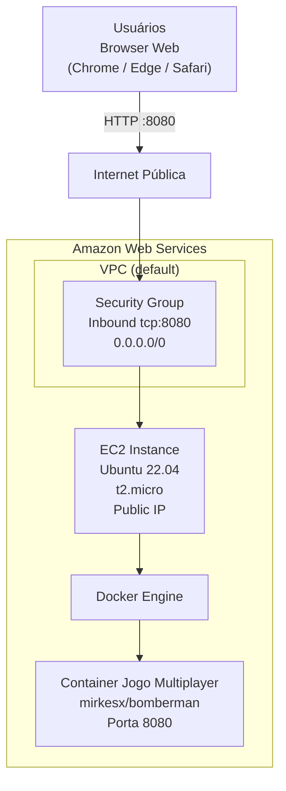

# Lab 001 - Jogo Web Multiplayer no EC2 (AWS)

## Objetivo

Provisionar uma instância EC2 na AWS, instalar Docker, executar um jogo multiplayer em container e acessar o jogo via navegador na porta `8080`.

## Informações do lab

- Dificuldade: Iniciante
- Tempo estimado: 35 minutos

## Contexto de execução (AWS Free Tier)

Este lab usa apenas recursos elegíveis ao **AWS Free Tier**:

- EC2 `t2.micro`: 750 horas/mês gratuitas nos primeiros 12 meses
- EBS (disco): 30 GB/mês gratuitos nos primeiros 12 meses

> **Atenção:** lembre-se de **terminar a instância** ao final do lab para não consumir as horas gratuitas desnecessariamente. Veja a seção de Limpeza.

Para monitorar o consumo do Free Tier:  
`Billing and Cost Management` → `Free Tier` no console da AWS.

## Pré-requisitos

- Conta AWS ativa (Free Tier ou créditos disponíveis)
- Acesso ao Console da AWS
- Região EC2 com disponibilidade de `t2.micro` (ex.: `us-east-1`, `sa-east-1`)

## Arquitetura do lab

- 1 instância EC2 Ubuntu 22.04 (`t2.micro`)
- 1 Security Group liberando `tcp:8080` (inbound) e `tcp:22` (EC2 Instance Connect)
- 1 container Docker com o jogo `mirkesx/bomberman`



## Passo 1 - Criar o Security Group

No Console da AWS:

1. Acesse `EC2` → `Security Groups` → `Create security group`
2. Configure:
   - Name: `web-game-sg`
   - Description: `Security group para jogo web multiplayer`
   - VPC: default
3. Em **Inbound rules**, adicione duas regras:
   | Type | Protocol | Port | Source |
   |---|---|---|---|
   | Custom TCP | TCP | 8080 | 0.0.0.0/0 |
   | SSH | TCP | 22 | 0.0.0.0/0 |
4. Clique em `Create security group`

> Nota de segurança: source `0.0.0.0/0` é usado aqui apenas para simplificar o acesso didático. Em produção, restrinja os IPs de origem.

## Passo 2 - Criar a instância EC2

No Console da AWS:

1. Acesse `EC2` → `Instances` → `Launch instances`
2. Configure:
   - Name: `web-game-server`
   - AMI: `Ubuntu Server 22.04 LTS` (64-bit x86)
   - Instance type: `t2.micro` (**Free tier eligible**)
   - Key pair: `Proceed without a key pair` (usaremos EC2 Instance Connect)
   - Network settings: selecione o security group `web-game-sg`
   - Storage: 8 GB gp3 (padrão)
3. Clique em `Launch instance`

> Aguarde o status mudar para `Running` antes de prosseguir (~30 segundos).

## Passo 3 - Conectar na instância (EC2 Instance Connect)

1. Na lista de instâncias, selecione `web-game-server`
2. Clique em `Connect`
3. Selecione a aba `EC2 Instance Connect`
4. Clique em `Connect`

Um terminal no navegador será aberto diretamente na instância.

## Passo 4 - Instalar Docker na instância

No terminal da instância, rode:

```bash
sudo apt update
sudo apt install -y docker.io
sudo systemctl enable --now docker
sudo usermod -aG docker $USER
newgrp docker
```

## Passo 5 - Executar o jogo em container

```bash
docker pull mirkesx/bomberman
docker run -d --name jogo-web -p 8080:8080 mirkesx/bomberman
docker ps
```

## Passo 6 - Acessar no navegador

1. No console da AWS, copie o **Public IPv4 address** da instância
2. Abra no navegador:

```text
http://SEU_PUBLIC_IP:8080/
```

Exemplo:

```text
http://54.175.23.91:8080/
```

## Validação guiada

### Teste 1 - Container em execução

Comando:

```bash
docker ps
```

Resultado esperado:

- Container `jogo-web` listado com status `Up`
- Mapeamento de porta exibindo `0.0.0.0:8080->8080/tcp`

### Teste 2 - Aplicação respondendo internamente

Comando:

```bash
curl http://localhost:8080
```

Resultado esperado:

- Retorno HTML/conteúdo da aplicação sem erro de conexão

### Teste 3 - Security Group aplicado

Verificação no Console da AWS:

- Security Group `web-game-sg` associado à instância
- Regra inbound `tcp:8080` de `0.0.0.0/0` presente

### Teste 4 - Acesso externo funcionando

No navegador, acesse `http://SEU_PUBLIC_IP:8080/`.

Resultado esperado:

- Jogo carregando no navegador a partir do IP público da instância

## Limpeza

Para não consumir horas do Free Tier após o lab:

1. **Terminar a instância:**  
   `EC2` → `Instances` → selecione `web-game-server` → `Instance state` → `Terminate instance`

2. **Deletar o Security Group (opcional):**  
   `EC2` → `Security Groups` → selecione `web-game-sg` → `Actions` → `Delete security groups`

> Instâncias terminadas são removidas automaticamente após algumas horas. O disco EBS associado também é deletado por padrão.

## Referência

- [AWS Free Tier](https://aws.amazon.com/free/)
- [Imagem do jogo: mirkesx/bomberman](https://hub.docker.com/r/mirkesx/bomberman)
