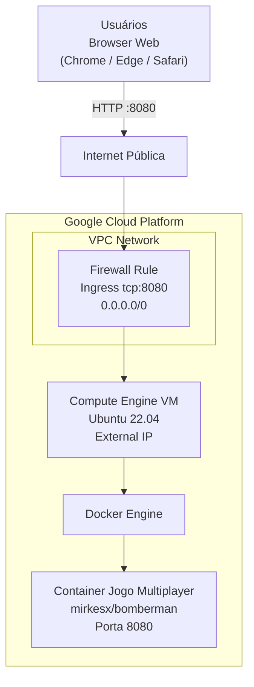

# Lab 001 - Jogo Web Multiplayer no Compute Engine (GCP)

## Objetivo

Provisionar uma VM no Google Compute Engine, instalar Docker, executar um jogo multiplayer em container e acessar o jogo via navegador na porta `8080`.

## Informações do lab

- Dificuldade: Iniciante
- Tempo estimado: 30 minutos

## Contexto de execução (Google Skills ou Free Tier)

Você pode iniciar um ambiente de laboratório no Google Skills e usar os créditos mensais para executar este exercício.

Exemplos de labs para iniciar ambiente:

- https://www.skills.google/focuses/3563
- https://www.skills.google/focuses/11952

> Observação: os links acima servem para abrir um ambiente de prática no GCP. Depois de entrar no console, siga os passos deste roteiro e não os passos que o GCP Skills pede.

Se preferir usar conta própria, você também pode usar o Free Tier do Google Cloud:

- https://docs.cloud.google.com/free/docs/free-cloud-features?hl=pt-br

## Pré-requisitos

- Se ainda não tiver conta, criar/ativar Free Tier em: https://docs.cloud.google.com/free/docs/free-cloud-features?hl=pt-br
- Conta com acesso ao Google Cloud (Google Skills ou conta própria)
- Projeto GCP ativo
- Permissão para criar VM e regra de firewall
- Cloud Shell habilitado ou terminal SSH da VM

## Arquitetura do lab

<details>
<summary><strong>Ver arquitetura</strong></summary>

- 1 VM Ubuntu 22.04 no Compute Engine
- 1 regra de firewall liberando `tcp:8080`
- 1 container Docker com o jogo `mirkesx/bomberman`



</details>

## Opções de execução

Você pode concluir o lab de duas formas:

- **Opção A (manual):** criando recursos no Console GCP
- **Opção B (Cloud Shell):** criando recursos via comandos `gcloud`

<details>
<summary><strong>Opção A - Manual (Console GCP)</strong></summary>

### Passo 1 - Criar a VM

No Console do GCP:

1. Acesse `Compute Engine` → `VM instances` → `Create instance`
2. Configure:
    - Nome: `web-game-server`
    - Região/Zona: qualquer (ex.: `us-central1-a`)
    - Tipo: `e2-small` (2 vCPU, 2 GB RAM)
    - OS: `Ubuntu 22.04 LTS`
    - Disco: `10 GB` (Standard)
3. Crie a instância

> Não é obrigatório marcar `Allow HTTP` ou `Allow HTTPS` para este lab.

### Passo 2 - Criar regra de firewall (porta do jogo)

No Console do GCP:

1. Acesse `VPC network` → `Firewall` → `Create firewall rule`
2. Configure:
    - Name: `allow-web-game-8080`
    - Direction of traffic: `Ingress`
    - Targets: `All instances in the network`
    - Source IPv4 ranges: `0.0.0.0/0`
    - Protocols and ports: `Specified protocols and ports` → `tcp:8080`
3. Salve a regra

> Nota de segurança: neste lab didático, a origem `0.0.0.0/0` é usada para simplificar o acesso. Em cenários reais, restrinja os IPs de origem ao mínimo necessário.

### Passo 3 - Instalar Docker e subir o jogo

Conecte por SSH na VM e rode:

```bash
sudo apt update
sudo apt install -y docker.io
sudo systemctl enable --now docker
sudo usermod -aG docker $USER
newgrp docker
docker pull mirkesx/bomberman
docker run -d --name jogo-web -p 8080:8080 mirkesx/bomberman
docker ps
```

### Passo 4 - Acessar no navegador

1. Copie o `External IP` da VM no Compute Engine
2. Abra no navegador:

```text
http://SEU_EXTERNAL_IP:8080/
```

</details>

<details>
<summary><strong>Opção B - Cloud Shell (comandos gcloud)</strong></summary>

No `Cloud Shell`, execute:

```bash
PROJECT_ID=$(gcloud config get-value project)
ZONE="us-central1-a"
INSTANCE_NAME="web-game-server-cli"
FIREWALL_RULE="allow-web-game-8080-cli"

gcloud compute instances create "$INSTANCE_NAME" \
   --zone="$ZONE" \
   --machine-type="e2-small" \
   --image-family="ubuntu-2204-lts" \
   --image-project="ubuntu-os-cloud" \
   --boot-disk-size="10GB" \
   --tags="web-game"

gcloud compute firewall-rules create "$FIREWALL_RULE" \
   --network="default" \
   --allow="tcp:8080" \
   --source-ranges="0.0.0.0/0" \
   --target-tags="web-game"

gcloud compute ssh "$INSTANCE_NAME" --zone="$ZONE" --command='sudo apt update && sudo apt install -y docker.io && sudo systemctl enable --now docker && sudo docker pull mirkesx/bomberman && sudo docker run -d --name jogo-web -p 8080:8080 mirkesx/bomberman && sudo docker ps'

EXTERNAL_IP=$(gcloud compute instances describe "$INSTANCE_NAME" --zone="$ZONE" --format='get(networkInterfaces[0].accessConfigs[0].natIP)')
echo "Acesse: http://$EXTERNAL_IP:8080/"
```

> Se a regra de firewall já existir, ajuste o nome em `FIREWALL_RULE`.

</details>

## Validação guiada

### Teste 1 - Container em execução

Comando:

```bash
docker ps
```

Resultado esperado:

- Container `jogo-web` listado com status `Up`
- Mapeamento de porta exibindo `0.0.0.0:8080->8080/tcp`

### Teste 2 - Aplicação respondendo internamente

Comando:

```bash
curl http://localhost:8080
```

Resultado esperado:

- Retorno HTML/conteúdo da aplicação sem erro de conexão

### Teste 3 - Regra de firewall aplicada

Verificação no Console do GCP:

- Regra `allow-web-game-8080` (manual) ou `allow-web-game-8080-cli` (Cloud Shell) criada
- Direção `Ingress`
- Porta `tcp:8080` liberada

### Teste 4 - Acesso externo funcionando

No navegador, acesse `http://SEU_EXTERNAL_IP:8080/`.

Resultado esperado:

- Jogo carregando no navegador a partir do IP externo da VM

## Limpeza

Se usou a opção manual:

1. Exclua a VM `web-game-server`
2. Exclua a regra de firewall `allow-web-game-8080`

Se usou a opção Cloud Shell:

```bash
gcloud compute instances delete web-game-server-cli --zone=us-central1-a --quiet
gcloud compute firewall-rules delete allow-web-game-8080-cli --quiet
```

---

Fonte base do roteiro: documento interno do curso (Lab_GCP_Jogo_Web_Multiplayer_Docker_Toolbox_PTBR_v2).
