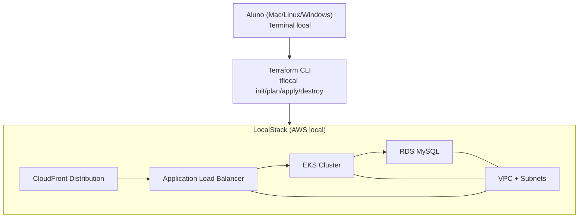

# Lab 001 - Terraform AWS com LocalStack

## Objetivo

Executar um cenário real de infraestrutura com Terraform em ambiente local, usando LocalStack para simular serviços AWS.

## Duração e dificuldade

- Duração estimada: 25 a 40 minutos
- Dificuldade: iniciante a intermediário

## Repositório base

- https://github.com/toolbox-playground/terraform-aws-localstack

## Contexto da prática

Este lab usa um projeto externo para praticar o fluxo essencial de IaC:
**subir ambiente local -> planejar -> aplicar -> destruir**.

## Pré-requisitos

- Terraform
- LocalStack
- `tflocal`
- `awslocal`
- `kubectl`

Se você ainda não tem o LocalStack instalado, siga a documentação oficial: https://docs.localstack.cloud/getting-started/installation/

## Arquitetura do lab

- Terraform (`tflocal`) aplica a infraestrutura no LocalStack.
- O LocalStack simula os principais serviços AWS usados no exercício.



## Fluxo recomendado do aluno

1. Clone o repositório base:

```bash
git clone https://github.com/toolbox-playground/terraform-aws-localstack.git
cd terraform-aws-localstack
```

2. Inicie o LocalStack:

```bash
localstack start
```

3. Em outro terminal, inicialize e valide o plano:

```bash
tflocal init
tflocal plan
```

4. Aplique a infraestrutura:

```bash
tflocal apply
```

5. Ao final da prática, destrua os recursos:

```bash
tflocal destroy
```

## Como demonstrar em aula (roteiro curto)

1. Mostrar `tflocal plan` e explicar o que será criado.
2. Rodar `tflocal apply` e validar outputs principais.
3. Encerrar com `tflocal destroy` para reforçar ciclo completo.

## Dicas práticas

- Sempre revise o `plan` antes do `apply`.
- Se ocorrer erro, valide primeiro se o LocalStack está ativo.
- Trabalhe em ciclos curtos: ajustar -> plan -> apply.

## Referência

- README oficial do exercício: https://github.com/toolbox-playground/terraform-aws-localstack/blob/main/README.md
