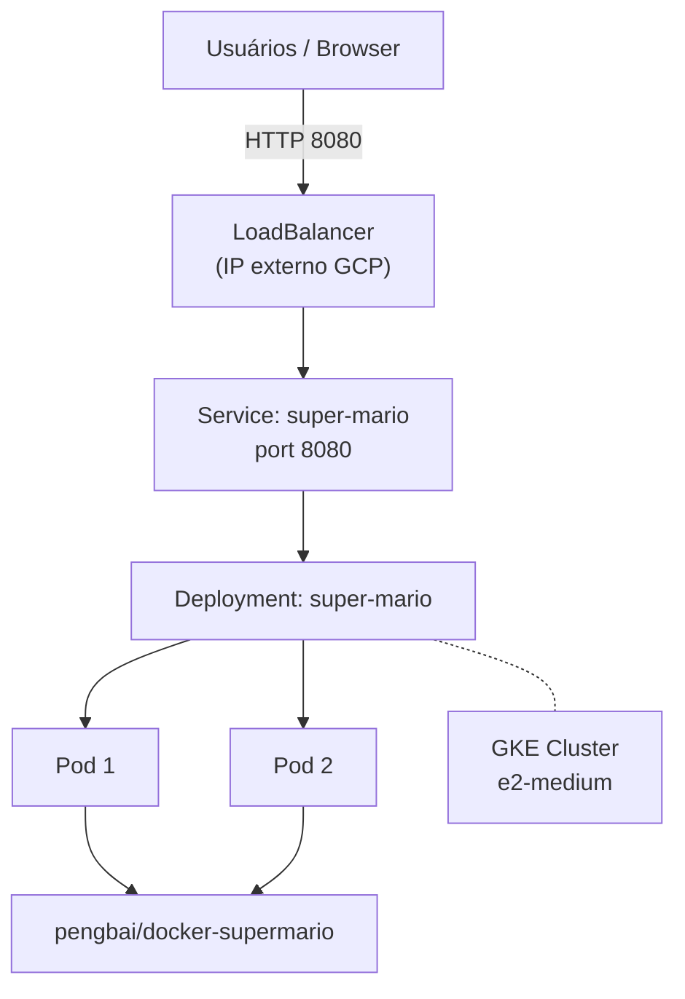

# Lab 002 - Deploy no Kubernetes (GKE) na Nuvem

## Objetivo

Criar um cluster Kubernetes gerenciado no **GCP (GKE)**, fazer deploy de um container usando apenas comandos `kubectl` (sem manifests/YAML) e expor o serviço publicamente na internet.

## Informações do lab

- Dificuldade: Iniciante
- Tempo estimado: 30-40 min
- Porta da aplicação: `8080`

## Pré-requisitos

- Para usar o lab do Google Skills (ambiente cloud grátis): https://www.skills.google/catalog_lab/911
- OU conta GCP ativa (Free Tier / créditos): https://docs.cloud.google.com/free/docs/free-cloud-features?hl=pt-br
- APIs habilitadas no projeto: `Kubernetes Engine API`

## Jogo usado

- Imagem Docker: `pengbai/docker-supermario:latest`
- Tipo: Super Mario Bros em navegador

---

## Diferença em relação ao Lab 001

| Lab 001 | Lab 002 |
|---------|---------|
| Cluster local (`kind`) | Cluster gerenciado (GKE) |
| Manifests YAML | Somente `kubectl` imperativo |
| `kind create cluster` | `gcloud container clusters create` |
| `kubectl apply -f` | `kubectl create deployment` + `kubectl expose` |

---

<details>
<summary><strong>Arquitetura</strong></summary>

- 1 GKE Cluster (Google Kubernetes Engine)
- 1 Node pool com `e2-medium`
- 1 Deployment com `pengbai/docker-supermario`
- 1 Service do tipo `LoadBalancer` (IP externo automático)



</details>

---

<details>
<summary><strong>Opção A - Manual (Console GCP)</strong></summary>

### 1. Criar o Cluster GKE

1. Abra o console GCP: https://console.cloud.google.com/
2. Pesquise por `Kubernetes Engine` e abra.
3. Se solicitado, habilite a API `Kubernetes Engine API`.
4. Vá em `Clusters` → `Create`.
5. Escolha `Standard` e configure:
   - Nome: `lab-mario-cluster`
   - Zona: `us-east1-b`
   - Node pool → Machine type: `e2-medium`
   - Number of nodes: `2`
6. Clique em `Create` e aguarde (~3 min).

### 2. Conectar ao Cluster

1. Clique no cluster criado e depois em `Connect`.
2. Clique em `Run in Cloud Shell` — isso abre o Cloud Shell já com o comando `gcloud container clusters get-credentials` pronto.
3. Execute o comando que aparecer. Exemplo:

```bash
gcloud container clusters get-credentials lab-mario-cluster --zone us-east1-b --project SEU_PROJECT_ID
```

4. Confirme a conexão:

```bash
kubectl get nodes
```

### 3. Criar o Deployment

```bash
kubectl create deployment super-mario \
  --image=pengbai/docker-supermario:latest \
  --replicas=2
```

Verifique:

```bash
kubectl get deployments
kubectl get pods
```

### 4. Expor o Serviço

```bash
kubectl expose deployment super-mario \
  --type=LoadBalancer \
  --port=8080 \
  --target-port=8080
```

Aguarde o IP externo (pode levar 1-2 min):

```bash
kubectl get service super-mario --watch
```

Quando `EXTERNAL-IP` não for mais `<pending>`, acesse:

```text
http://EXTERNAL_IP:8080/
```

</details>

---

<details>
<summary><strong>Opção B - Cloud Shell (comandos gcloud)</strong></summary>

Abra o **Cloud Shell** no canto superior direito do console GCP e execute:

```bash
# Configuração inicial
PROJECT_ID=$(gcloud config get-value project)
ZONE="us-east1-b"
CLUSTER_NAME="lab-mario-cluster"

# Habilitar a API do GKE (se ainda não estiver habilitada)
gcloud services enable container.googleapis.com --project "$PROJECT_ID"

# Criar o cluster GKE
gcloud container clusters create "$CLUSTER_NAME" \
  --zone "$ZONE" \
  --num-nodes=2 \
  --machine-type=e2-medium \
  --project "$PROJECT_ID"

# Obter credenciais do cluster
gcloud container clusters get-credentials "$CLUSTER_NAME" \
  --zone "$ZONE" \
  --project "$PROJECT_ID"

# Confirmar conexão
kubectl get nodes

# Criar o deployment
kubectl create deployment super-mario \
  --image=pengbai/docker-supermario:latest \
  --replicas=2

# Expor como LoadBalancer na porta 8080
kubectl expose deployment super-mario \
  --type=LoadBalancer \
  --port=8080 \
  --target-port=8080

# Aguardar IP externo
kubectl get service super-mario --watch
```

Quando o `EXTERNAL-IP` aparecer, acesse:

```bash
EXTERNAL_IP=$(kubectl get service super-mario -o jsonpath='{.status.loadBalancer.ingress[0].ip}')
echo "Acesse: http://$EXTERNAL_IP:8080/"
```

</details>

---

## Validação

- Nodes em `Ready`: `kubectl get nodes`
- Pods em `Running`: `kubectl get pods`
- Service com `EXTERNAL-IP`: `kubectl get service super-mario`
- Jogo abrindo no browser: `http://EXTERNAL_IP:8080/`

---

## Escalar manualmente (bônus)

```bash
kubectl scale deployment super-mario --replicas=3
kubectl get pods --watch
```

---

## Limpeza

**Via Cloud Shell:**

```bash
# Deletar service (libera o LoadBalancer/IP externo)
kubectl delete service super-mario

# Deletar deployment
kubectl delete deployment super-mario

# Deletar o cluster GKE
gcloud container clusters delete lab-mario-cluster \
  --zone us-east1-b \
  --quiet
```

**Via Console:** `Kubernetes Engine` → `Clusters` → selecione `lab-mario-cluster` → `Delete`.

> ⚠️ Sempre delete o cluster após o lab — GKE cobra por horas de uso dos nodes.

---

## Referências

- [Google Skills Lab - Kubernetes Engine: Qwik Start](https://www.skills.google/catalog_lab/911)
- [GCP Free Tier](https://docs.cloud.google.com/free/docs/free-cloud-features?hl=pt-br)
- [pengbai/docker-supermario no Docker Hub](https://hub.docker.com/r/pengbai/docker-supermario)
- [kubectl Cheat Sheet](https://kubernetes.io/docs/reference/kubectl/cheatsheet/)
